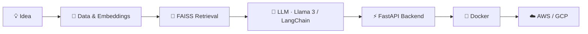

<div align="center">


[](https://git.io/typing-svg)

<a href="https://linkedin.com/in/prabanchanarul"></a>
<a href="mailto:prabanjanarul2005@gmail.com"></a>
<a href="https://github.com/Prabanchan-Arul"></a>

<br/>


</div>

---

## 👋 About Me

I'm an **AI & Data Science graduate (B.Tech, 2026)** who builds practical **AI/ML and GenAI applications**. I've worked on LLM chatbots, RAG pipelines and ML models through two internships, and I enjoy taking an idea all the way from **prototype → AI pipeline → API → deployable app**.

- 🔎 Building RAG systems with **Llama 3 (Ollama), LangChain and FAISS**
- 🧠 Creating multi-step agents with **LangGraph**
- ⚡ Serving models through **FastAPI** and shipping with **Docker**
- 📝 Published author: conference paper at **ICNKAI-2K25**
- 🎯 Looking for **entry-level AI/ML & GenAI Engineer** roles

<div align="center">

</div>

---

## 🧠 How I Build



---

## 🚀 Featured Projects

### 🏛️ SchemeSense — AI-Powered SmartGov Scheme Advisor *(Final Year Project)*

<a href="https://github.com/Prabanchan-Arul/RAG_APP">

</a>

Government scheme eligibility rules are full of jargon, so people miss schemes they qualify for. SchemeSense explains them in plain language.

- 🔎 **Llama 3 (Ollama) RAG** turns eligibility criteria into simple explanations
- 🖥️ Full-stack app with **React.js + FastAPI + MySQL**
- 🎯 **Rule-based engine + Scikit-learn recommender** to surface relevant schemes
- 🌐 **Multilingual** support and **Twilio** integration to close the awareness gap


---

### 📄 AI-Powered Resume–Job Matching System

Keyword-only ATS screening rejects qualified candidates over literal mismatches. This system matches on **meaning** instead.

- 🧠 **LangChain + Llama 3 + FAISS** semantic similarity search with LLM reasoning
- ⚡ **FastAPI** RESTful backend with a **Streamlit** frontend
- 📊 Real-time **gap analysis** between a resume and a job description, so candidates see why they match or don't


---

## 🛠️ Tech Stack

**Languages**


**ML & Data**


**GenAI & LLMs**


**Backend, Frontend & Cloud**


**Tools**


---

## 💼 Experience

| Period | Role | What I did |
| :-- | :-- | :-- |
| **Dec 2025 – Feb 2026** | **AI/ML Intern** · BETA Softnet (OPC) Pvt Ltd | Built LLM chatbots with **LangChain & LangGraph** for context-aware, multi-step reasoning with less human involvement. Deployed LLM predictions via **FastAPI** REST APIs and built a **Scikit-learn** classification model. |
| **Jul 2025 – Sep 2025** | **Data Science Intern** · Top Tech Developers | Did end-to-end data analysis and modeling in **Python** on real-world datasets. Built pre-processing and visualization pipelines to improve data quality for ML tasks. |

---

## 📝 Publication

> **Building Bridges: An Intelligent Platform to Connect Alumni and Students in Technical Education**
> ICNKAI-2K25 · 2025

---

## 🎓 Education

**B.Tech — Artificial Intelligence & Data Science**
Sriram Engineering College · Nov 2022 – May 2026 · **CGPA: 9.2 / 10**

---

## 📜 Certifications


---

## 📈 GitHub Stats

<div align="center">


<br/>


<br/>


<br/>


</div>

---

## 🐍 Contribution Snake

<div align="center">

</div>

---

## 🎯 Current Goals

```python
goals = {
    "AI": ["Build production-ready RAG systems", "Explore advanced agent architectures", "Ship reliable LLM applications"],
    "Engineering": ["Build scalable FastAPI services", "Level up cloud deployment (AWS / GCP)", "Learn production AI infrastructure"],
    "Career": ["AI/ML Engineer", "GenAI Engineer", "Junior AI Engineer"],
}
```

---

## 🤝 Let's Connect

<div align="center">

<a href="https://linkedin.com/in/prabanchanarul"></a>
<a href="mailto:prabanjanarul2005@gmail.com"></a>
<a href="https://github.com/Prabanchan-Arul"></a>

<br/><br/>

### 💡 Building AI systems that turn ideas into useful products.


</div>
